% Manual de administración de LeTSAS4
% Subdirección de Tecnologías de la Información y Comunicaciones; Servicio Andaluz de Salud
% Noviembre 2015

# Introducción

El objetivo de este manual es proporcionar información que permita dar
soporte de N1 y N2 a los administradores de los terminales en SAS.

En este manual, los administradores encontrarán los pasos necesarios que les
permitirán desenvolverse de forma fluida con las distintas herramientas que
existen para gestión de la plataforma. Además de una descripción completa,
se detallarán en este manual tanto los procedimientos de administración ya
existentes como todo lo necesario para que se puedan crear procedimientos
nuevos o derivados de los mismos.

A grandes rasgos, el sistema de administración y gestión de la plataforma
permite distribuir software y configuraciones de sistema a través de una consola
de gestión web a todos los equipos seleccionados.
Se ha desarrollado una colección de trabajos adaptados a las necesidades propias
del SAS que permita a los administradores una gestión mucho más eficiente.

# Descripción del puesto de trabajo

Un puesto de trabajo estará compuesto por el terminal, un cable de conexión a la
red eléctrica, ratón óptico y teclado con conexión USB y monitor. El teclado
podrá tener un lector de tarjetas criptográficas y/o lector de banda magnética
incorporados.

LeTSAS4 se ha confeccionado con compatibilidad para el hardware actual de la
plataforma de terminales ligeros,
aunque puede funcionar directamente o con pocas modificaciones sobre casi
cualquier plataforma x86 a partir de la subarquitectura i486:

# Filosofía de LeTSAS4

LeTSAS4 se fundamenta en estos principios básicos:

1. Simplificación: Debe ser un sistema operativo cuyo coste de mantenimiento y 
desarollo sea lo más bajo posible. Para ello hay varios condicionantes; una sola
imagen, un sólo núcleo y una sola forma de generar la distribución para toda la
plataforma hardware

1. Agilidad: Debemos ser capaces de poder incorporar cambios en el puesto cliente
que tenga este sistema operativo de forma muy ágil (en razón de días).

1. Flexibilidad: Debemos permitir que cada cuál pueda adaptar la distribución a 
sus condicionantes locales siempre y cuando se respeten los dos primeros puntos.

1. Apertura: Queremos hacer partícipes a toda la comunidad SAS del desarrollo 
del operativo, tanto dando ideas o retroalimentación, cómo, si así lo quieren,
aportando técnicamente todo lo que podamos mejorar.

1. Adaptación: "Estos son mis principios. Si no le gustan tengo otros.".

[https://ws001.juntadeandalucia.es/unifica/group/puesto-de-usuario/inicio](https://ws001.juntadeandalucia.es/unifica/group/puesto-de-usuario/inicio)

# Instalación de LeTSAS4

## Instalación en un terminal nuevo

Para la instalación de LeTSAS4 sobre un terminal nuevo procederemos exactamente
igual que lo hacíamos para LeTSAS3.

1. Descargamos la herramienta "unetbootin" (disponible para linux, mac y 
windows) desde la siguiente URL:
[https://unetbootin.github.io/](https://unetbootin.github.io).

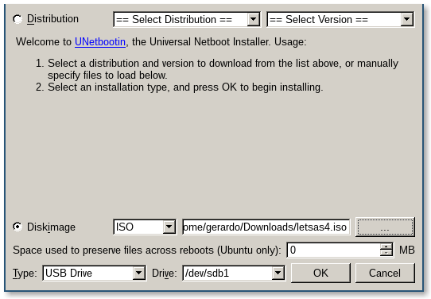

* Descargamos la iso de LeTSAS4 desde [http://10.201.68.103/letsas4.iso](http://10.201.68.103/letsas4).

* Insertamos un llavero USB de al menos 1GB y seleccionamos la imagen ISO de 
LeTSAS4 en unetbootin. El resto de valores por defecto queda invariante. 
"Planchamos" el USB pulsando en OK.

* Colocamos el llavero USB en el terminal y arrancamos desde él. Los terminales 
nuevos (T420) vienen ya preconfigurados de fábrica en BIOS para arrancar desde 
dispositivos USB externos.

* Cuando el equipo termina de cargar la instalación, nos pregunta lo siguiente:
    *   Va a instalar LeTSAS4 en este equipo.
        
        Todos los datos del disco duro se perderán.
        
        ¿Esta seguro que desea continuar (s/N)?  

    *   Elegimos la opción (s) y continuamos con Intro.

* Al terminar el proceso de instalación el terminal reiniciará automáticamente. 
Mostrando la siguiente información:
    * Sistemas de ficheros ... 

        El equipo monta el sistema de ficheros local (si no es un arranque por red), el sistema de compresión de ram ZRAM y los sistemas auxiliares (proc, sys, dev, tmp, /var/run, /var/log).

    * Red ...

        Se configura la red de forma automática a no ser que se especifique otra cosa en el fichero de configuración /etc/sysconfig/networkinterfaces.

    * Enlace con DMSAS ...

        Se levanta el servicio de autenticación contra LDAP y la gestión del cacheo de credenciales.

    * Servicios de red ...
        
        Se arranca el demonio xinetd que será el encargado de levantar servicios como el servidor http del portal del terminal o el servicio de remoto vnc
    
    * Sistema de acceso remoto ..

        Se ejecuta el demonio de acceso SSH (dropbear).

    * Sincronizacion de reloj ...
     
        Se configura el reloj del sistema mediante ntp.

    * Sistema de protección USB ...
        
        En algunos terminales T5725, T5735 aparecen problemas cuando se intercambian los alimentadores (unos pueden entregar más potencia que otros). Este script reinicializa el sistema USB para asegurar que después del arranque seguimos siendo capaces de detectar los dispositivos.

    * Actualizando ...
        Sistema de actualización automática mediante RSYNC. Cada provincia tiene su propio equipo de actualización (más en actualización del sistema).
    * Agente de altiris ...

     * Lanzador de agescon ...
    
         Este sistema permite al profesional que ya tenga un usuario en DMSAS y haya olvidado su clave levantar agescon para poder reiniciarla.

     * Terminado.
        El equipo ha terminado el proceso de arranque.

    Es posible que debido a que el sistema actualiza algunos binarios importantes durante el primer arranque que no se muestre el sistema gráfico. Podemos forzar su ejecución entrando en cualquier consola (ALT+F2), logándonos como superusuarios y ejecutandolo "a mano" (slim)

 * El aspecto de un terminal correctamente instalado e iniciado es el siguiente:

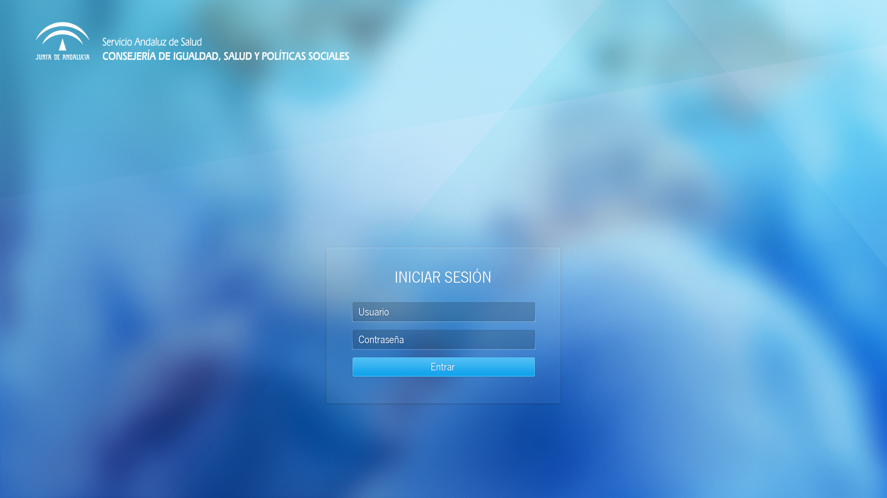

### Postinstalación de un terminal nuevo

Tras la instalación aún hay que realizar ciertas tareas sobre el terminal:

1. Cambiar el nombre del terminal al nombre definitivo. 

    El equipo levanta con un nombre provisional. Éste debe ser modificado para 
que el terminal sea accesible desde AltirisDS. Esta tarea la podemos realizar 
sobre el portal del terminal:
 
    1. Abrimos la siguiente URL desde el mismo navegador del terminal: 
[http://127.0.0.1/cgi-bin/cgi.sh](http://127.0.0.1/cgi-bin/cgi.sh)

    1. Seleccionamos la pestaña "Configuración".
    
    1. Introducimos el nombre y el código del terminal. Pulsamos "cambiar".
    
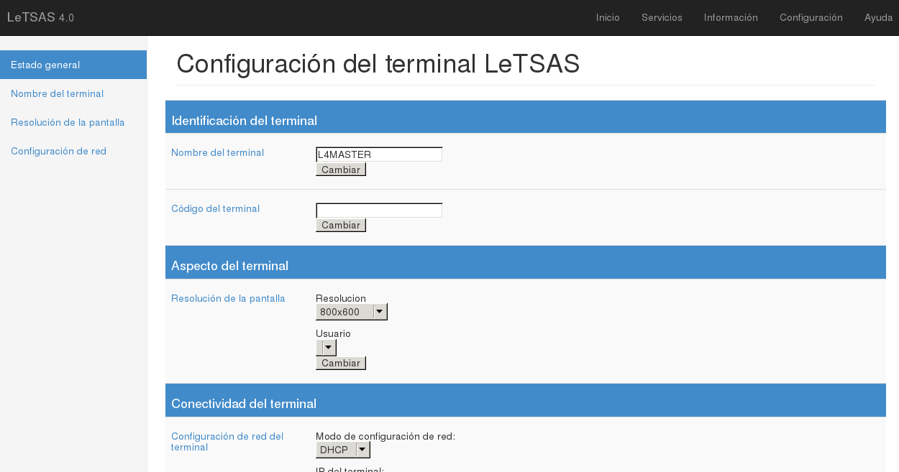

1. Reiniciar el agente Altiris del terminal. De ésta forma el servicio Altiris 
recoge el cambio de nombre. Éste reinicio se puede realizar desde el propio 
portal del terminal (mirar más adelante).

### Instalación en un terminal que tiene actualmente LeTSAS3

El proceso de actualización de un terminal desde LeTSAS3 a LeTSAS4 es totalmente 
desatendido.
Sólamente hay que ejecutar un job (Migracion L4) en la consola de AltirisDS 
sobre el terminal o conjunto de terminales a actualizar:

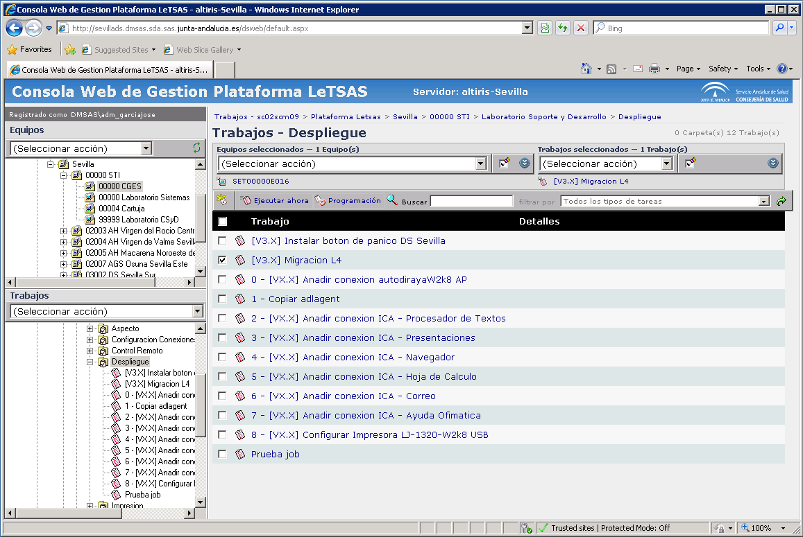

Éste trabajo en lote efectuará los siguientes cambios en el terminal:

1. Instalará un nuevo kernel y sistema de ficheros en imagen para el arranque.
1. Colocará una nueva entrada en el sistema de gestión de arranque del terminal 
(GRUB) para la actualización a LeTSAS4.
1. Reiniciará el terminal.

En este primer reinicio el equipo usa el nuevo núcleo y sistema de arranque para
preparar el terminal tal y como lo haría la ISO (particiona, formatea, etc). 

Después de esta preparación el equipo reinicia una segunda vez
usando  una imagen mínima de LeTSAS e incorporando todos los ficheros necesarios
al terminal.

Por último y tras otro reinicio el terminal se encontrará totalmente actualizado.

Todos los iconos que ya tuviera configurados, accesos a Citrix o RDP son
 respetados y colocados como configuración del terminal.

# Portal del terminal

El terminal cuenta con un portal de autogestión al que se puede acceder 
mediante la siguiente URL:
[http://127.0.0.1/cgi-bin/cgi.sh](http://127.0.0.1/cgi-bin/cgi.sh)

En este portal podemos encontrar varias pestañas que agrupan la funcionalidad:

* Inicio: En esta pestaña podemos observar una vista general del desempeño del
 terminal: Memoria, CPU y Disco. 
Usando la barra lateral izquierda podemos acceder a más detalle sobre cada uno
de los subsistemas del terminal:
    
    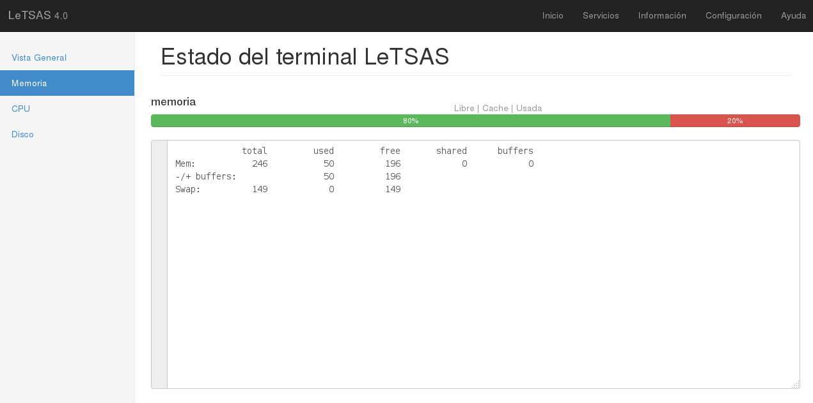

* Servicios: En esta pestaña podemos observar qué servicios del terminal están arrancados y en caso de algún problema con alguno de ellos, reiniciarlo. En la barra izquierda podemos observar cada servicio con más detalle.
   
    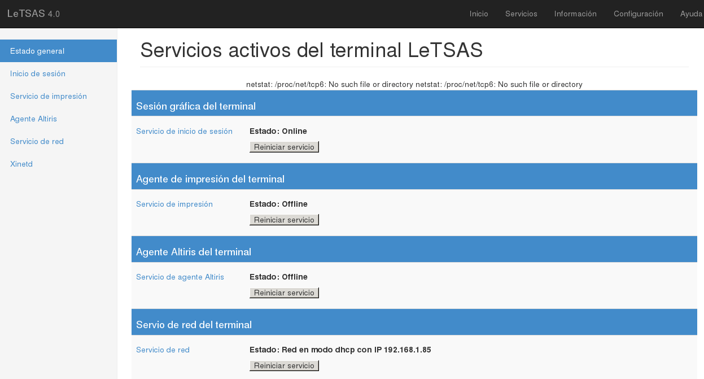

* Información: En esta pestaña se muestra la información de todo el hardware conectado y reconocido en el terminal.
    
    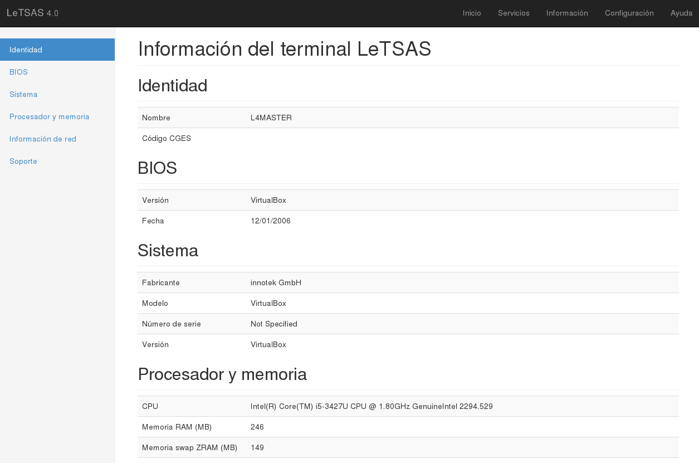

* Configuración: En esta pestaña podemos configurar ciertos aspectos del terminal, como:
    * Nombre del terminal.
    * Código del terminal.
    * Aspecto del terminal:
        * Resolución: La resolución del terminal está generalmente autodetectada por el panel conectado al mismo. En caso de que queramos forzar determinada resolución aquí podemos hacerlo.
        * Perfiles de usuario: Podemos borrar el perfil del usuario en caso de algún inconveniente con el mismo.
        * Conectividad: Podemos reconfigurar la red (DHCP, o manual).
        * Proxy: Este apartado te permite reconfigurar el valor del proxy usado por el equipo.
   
    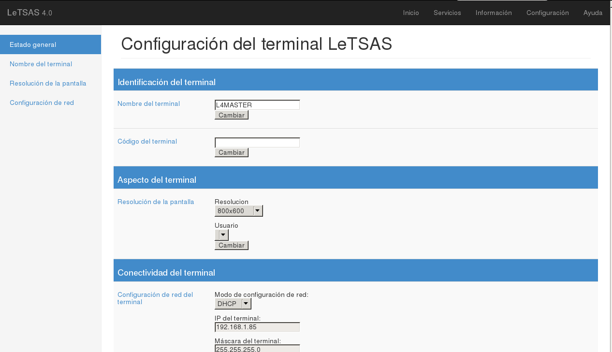

# Acceso remoto

El terminal por defecto levanta dos interfaces de acceso remoto:

1. SSH: A través del puerto 22. Sólo el superusuario acceder al equipo mediante este sistema.

1. VNC: Por el puerto 5900. Ahora mismo sólo hay una contraseña común para el acceso VNC pero esperamos más adelante poder utilizar los grupos del servicio de directorio.

# Personalizacion del terminal

Una de las novedades que incorpora LeTSAS4 es la capacidad de personalizar la distribución en cada provincia, distrito, área sanitaria, etc.

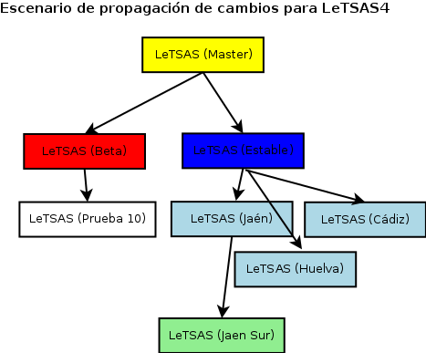

Estas personalizaciones se hacen sobre la base de LeTSAS4, es decir, todas las actualizaciones que haga el equipo de LeTSAS de base se incorporan a las diferentes ramas que cuelgan de ésta. De esta forma, podemos escoger la información a mostrar en el escritorio, los accesos directos de la barra de tareas o cualquier otra personalización del entorno que haga adaptarse mejor a LeTSAS4 para nuestros usuarios.

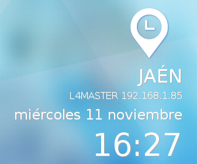

El cambio del terminal de una rama a otra se hace modificando una variable en el actualizador y posteriormente, ejecutándolo. (/sbin/updater.sh).

# Actualización del terminal

El terminal en el proceso de apagado se actualiza con los últimos cambios de la rama indicada en el script de actualización. Esta actualización se realiza en un segundo plano.

El sistema de actualización usa un sistema de "diferencias" transmitiendo sólo la información que ha cambiado. Típicamente después del despliegue solo suelen ser unas decenas de KB. Para ésta actualización cada provincia posee un servidor de actualización que se alimenta automáticamente del servidor de generación de imágenes.

# Cambios para el usuario

## Inicio de sesión.

En el inicio de sesión cada profesional debe introducir su nombre de usuario y contraseña de DMSAS para identificarse en el sistema. 
Si el usuario hubiera olvidado su contraseña DMSAS puede hacer uso del "Lanzador de Agescon", para ello sólo tiene que introducir su DNI en el lector criptográfico y el sistema (si el profesional tiene cuenta en DMSAS) le levantará un navegador a pantalla completa con Agescon. Para cerrar este navegador sólo tiene que extraer el DNI del lector.

Para pasar del campo de usuario al campo de contraseña hay que usar el intro (no vale el tabulador). No hay soporte para el puntero en esta primera pantalla por cuestiones de diseño del gestor de ingreso. 

En el caso de que el usuario tenga una unidad de red configurada como "home" en DMSAS ésta se monta automáticamente en el inicio de sesión en la carpeta $HOME/dmsas_hd.

## Escritorio

En el escritorio podemos encontrar hasta 3 sistemas diferentes de notificación e información para el usuario.

Conky, que hemos mencionado anteriormente, permite mostrar información textual así como pequeñas gráficas con una animación muy limitada (1 frame cada 5-10 segundos).
En este sistema estamos mostrando actualmente la provincia del terminal, su nombre e IP y el tiempo actual (temperatura y estado del ciento). Pero podría mostrar cualquier tipo de información necesaria para el usuario.

~~~~ {#conkyrc .sh .numberLines startFrom="56"}
        ${execi 300 curl -s "http://weather.yahooapis.com/forecastrss?w=762761&u=c" -o ~/.cache/weather.xml}
        ${image /usr/share/icons/letsas/fecha.png -p 195,0 -s 74x98}\
        ${voffset 90}${font DejaVu Sans :size=24}${alignr}JAÉN${font}
        ${voffset 10}${font DejaVu Sans :size=12}${alignr}${nodename} ${addrs}${font}
        ${offset -30}${voffset 10}${font DejaVu Sans :size=18}${alignr}${time %A %d %B}${font}
        ${voffset 10}${font DejaVu Sans :size=40}${alignr}${time %H:%M}${font}
        ${execi 300 cp -f /usr/share/icons/letsas/weather/$(grep "yweather:condition" ~/.cache/weather.xml 
        | grep -o "code=\"[^\"]*\"" | grep -o "\"[^\"]*\"" 
        | grep -o "[^\"]*" | awk 'NR==1').png ~/.cache/weather-1.png}
        ${voffset 10}${font DejaVu Sans :size=36}${alignr}
        ${execi 300 grep "yweather:condition" ~/.cache/weather.xml 
        | grep -o "temp=\"[^\"]*\"" | grep -o "\"[^\"]*\"" | grep -o "[^\"]*"}°${font}
~~~~~

Noticias: Es un navegador web embebido en el fondo de escritorio. Está pensado para mostrar información extraida de un RSS indicado y con una velocidad de refresco baja.

Información de interés: Al igual que noticias, es otro navegador web embebido pensado para extraer información de una entrada de un RSS concreto. Puede usarse, por ejemplo, para mostrar alertas al usuario de forma dinámica de los problemas que puede encontrar ese día en los diferentes sistemas.

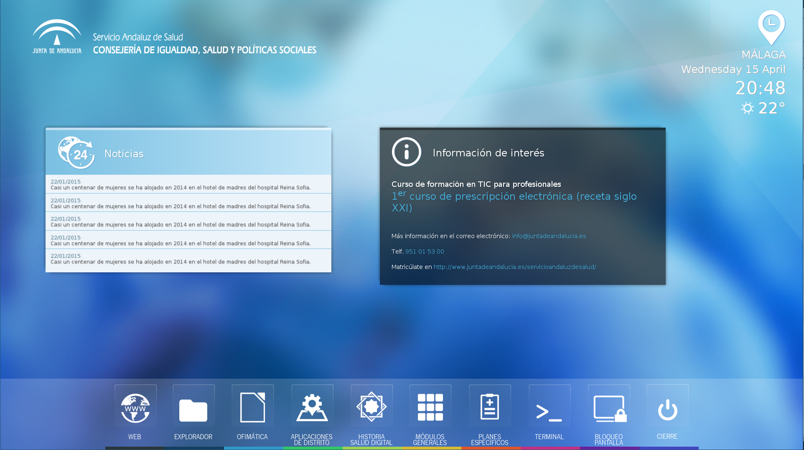

## Aplicaciones

En la barra de tareas, como se puede observar en la figura anterior, hay una serie de lanzadores pensados para contener los accesos directos a las diferentes aplicaciones centralizadas y locales del terminal. 

En caso de que existan multiples accesos a aplicaciones relacionadas, éstos se agrupan en "cajones" cuyo menú tiene un color característico marcado en la parte inferior de su lanzador.

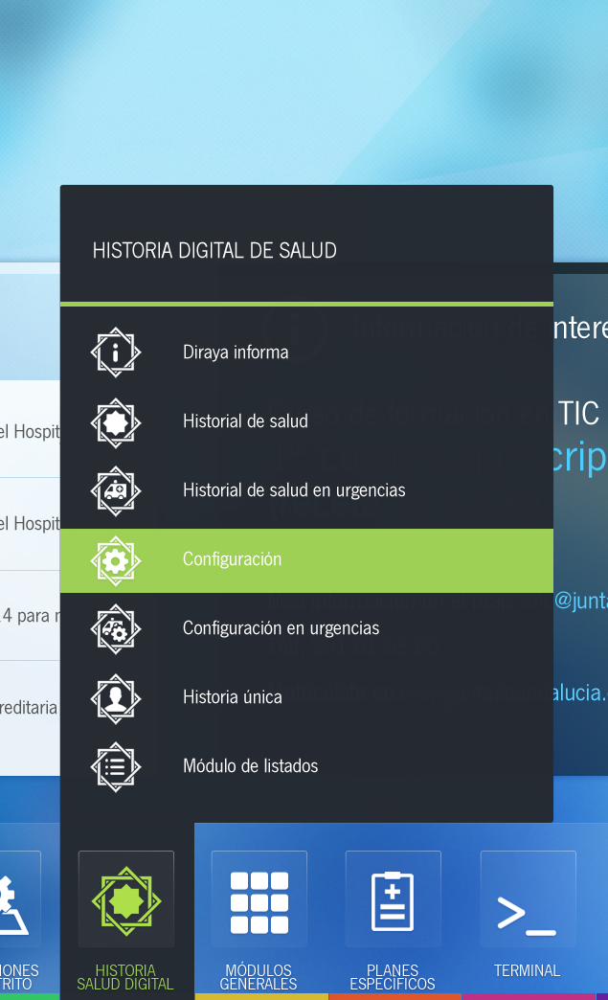

Entre las aplicaciones locales cabe destacar las siguientes:

### Navegador

LeTSAS4 posee ahora un navegador con soporte completo a nuevos estándares (HTML5) con un 100/100 en el acid3 test.

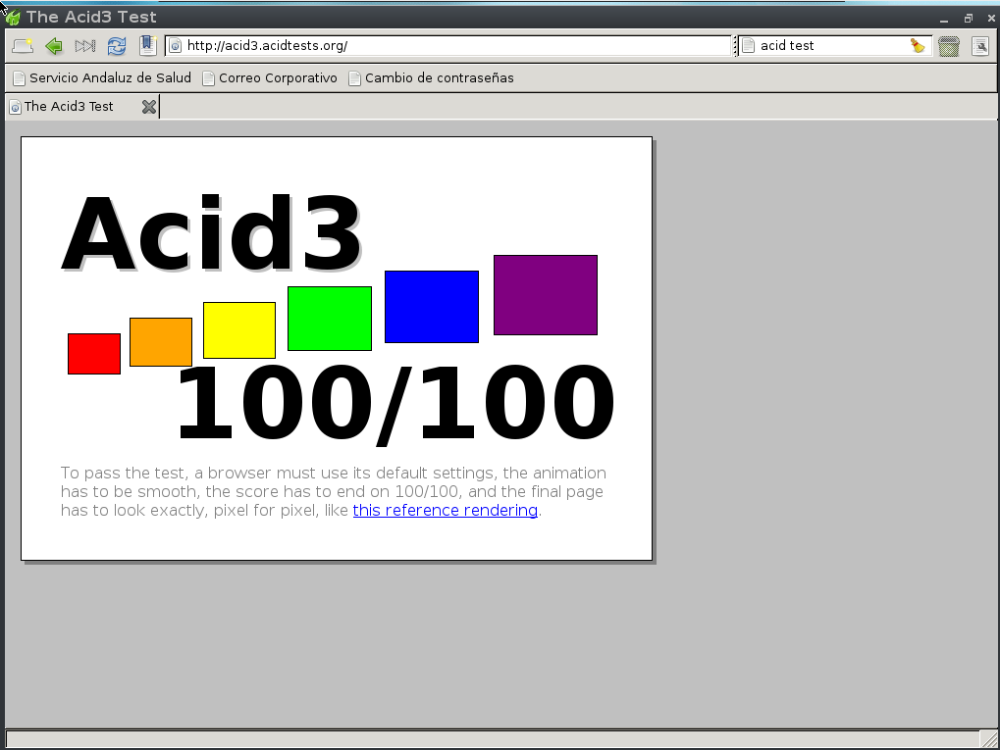

Esperamos que todas las aplicaciones corporativas web, una vez pasen un ciclo completo de desarollo, sean compatibles con el motor de este navegador.

Por supuesto el navegador se puede usar ahora para abrir el correo corporativo sin tener que usar ViaExpress ahorrando bastante tiempo al profesional.
El navegador incluye los plugins de java 1.6.23 y flash 9 [^1].

[^1]: Flash 9 fue la última versión de este software con soporte para procesadores i486.

### Ofimática
Todos los terminales que tengan un disco de 512Mb o superior disponen de Libreoffice 5 completo. Desde libreoffice se pueden guardar los documentos en el disco local del terminal, o en una unidad de red caso de una en DMSAS o en cualquier otro servicio CIFS o WebDAV ofrecido al usuario.

### Visor de documentos PDFs.
Los terminales incorporan el visor de documentos Evince, que permite no solo visualizar si no también el rellenado de formularios en formato PDF.
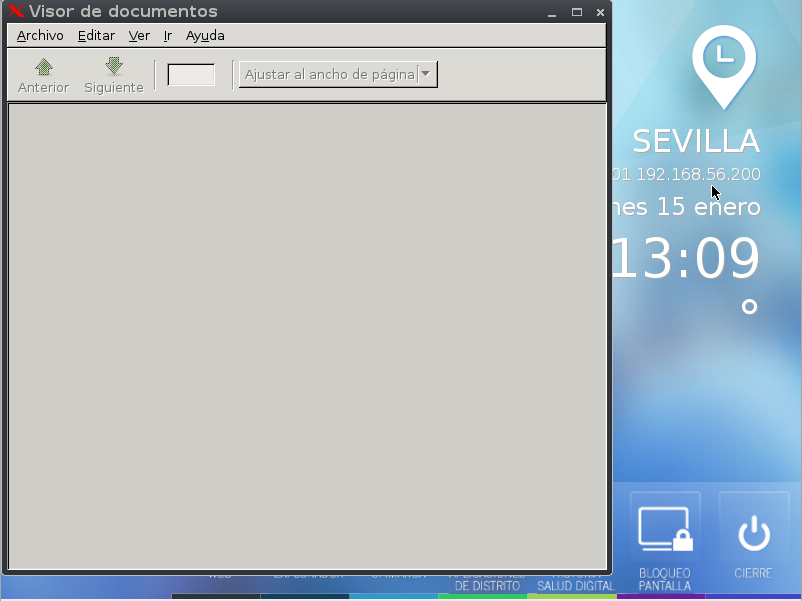

### Explorador de ficheros
El sistema tiene un explorador de ficheros que permite al usuario navegar por las diferentes carpetas y unidades de red a las que tiene acceso y abrir desde el mismo los documentos.

### Impresión
Las impresoras que tenemos en el parque SAS se autoconfiguran al conectarlas al terminal con LeTSAS4. Si es un caso especial de configuración de impresión (puestos de admisión) entonces esa configuración se puede aplicar mediante "Job" o desde el portal del terminal.
La impresora autoconfigurada funciona tanto en modo "Local" (Ofimática, Navegador, etc) como en remoto (RDP, Citrix).

### Bloqueo del terminal
El usuario puede bloquear su sesión siempre que quiera mediante el botón "Bloqueo de Pantalla", o si lo prefiere puede cerrar su sesión mediante el botón "Cierre". En caso de que el profesional no interactue durante un tiempo predeterminado con el terminal la sesión se bloqueará de forma automática, pudiendo proceder a su desbloqueo introduciendo de nuevo su contraseña.
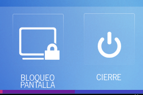

### Apagado y reinicio del terminal
Mediante el menu de cierre del terminal podemos acceder a las diferentes opciones que nos permitirán apagar o reiniciar el equipo o cerrar la sesión del usuario.
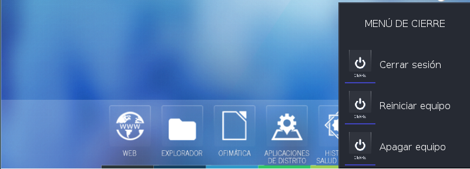

En caso de que otro usuario quiera acceder al terminal estando una sesión bloqueada, puede forzar el cierre de ésta sesión mediante la tecla F11 en la pantalla de bloqueo de sesión.

### Acceso a aplicaciones remotas

LeTSAS4 viene con Citrix Receiver 13.1, cliente RDP y VNC. Éstas son las herramientas que se usan para el acceso a las aplicaciones remotas.

### Atajos de teclado

En LeTSAS4 disponemos de los siguientes atajos de teclado:

        <Key mask="A" key="Tab">nextstacked</Key>
        <Key mask="A" key="F4">close</Key>
        <Key mask="A" key="#">desktop#</Key>
        <Key mask="A" key="F2">window</Key>
        <Key mask="A" key="F9">minimize</Key>
        <Key mask="A" key="F10">maximize</Key>
        <Key mask="AC" key="8">exec:rxvt</Key>
        <Key keycode="115">showdesktop</Key>
        <Key keycode="116">showtray</Key>

### Barra de tareas

Si posicionamos el ratón en la parte superior de la pantalla, se despliega una barra que nos permite cambiar entre las tareas que se están ejecutando en ese momento. 

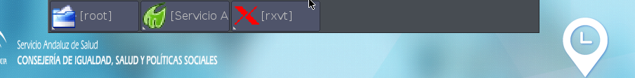

### Botón del pánico

Existe un atajo de teclado que permite alertar a los profesionales que se encuentran en el centro de salud de un problema de seguridad.
